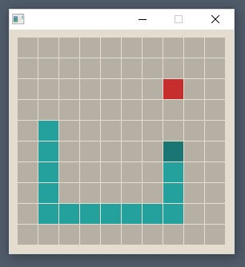

# snake-clone

Este é um simples clone do jogo Snake, feito para fins de estudo com foco na simplicidade, buscando a separação entre a lógica e as partes especificas relacionadas ao SDL 2.



# Como executar

```sh
cmake -S . -B build
cmake --build build
./build/SnakeClone
```
